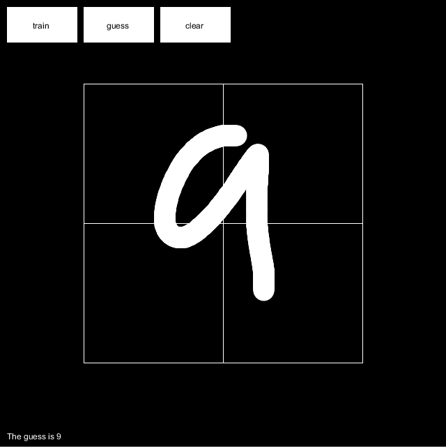

# processing-number-classifier


Simple number classifier using toy neural network. Uses MNIST dataset to train the neural network.

## Getting Started
### Prerequisites
You need to have installed [Processing Development Environment (PDE)](https://processing.org/download/)

### Installing
1. Clone the github project
  ```
  git clone https://github.com/lexesjan/processing-number-classifier.git
  ```
2. Open the NumberClassifier folder and double click the NumberClassifier.pde file
